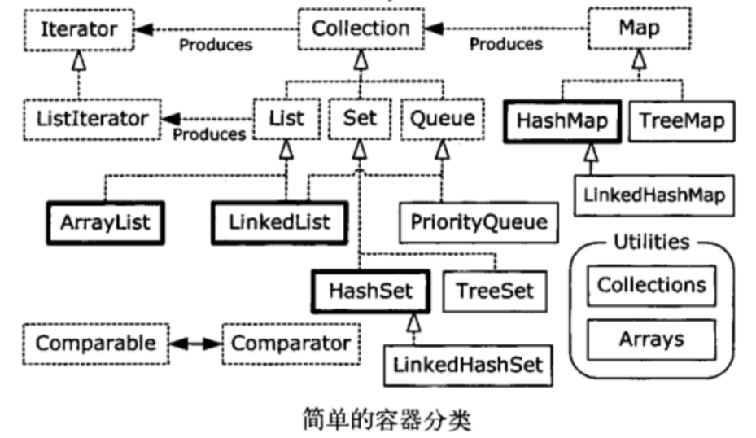

# JAVA编程思想学习四
> 第11章 ～ 第12章

## 第11章 持有对象

### 类型安全

通过范型指定类型

```
import java.util.*;

class Apple {
	public void f() {
		System.out.println("Apple f");
	}
}

class Orange {

}

public class Demo {
	// @SuppressWarnings("unchecked")
	// 可以任意添加，但如果加错了，运行时会报错
	public static void main(String[] args) {
		// 编译时期安全校验
		//ArrayList<Apple> apples = new ArrayList<Apple>();
		ArrayList apples = new ArrayList();
		apples.add(new Apple());
		apples.add(new Apple());
		apples.add(new Apple());
		// 运行时报错
		// apples.add(new Orange());
		for (int i = 0; i < apples.size(); i++) {
			Apple apple = (Apple)apples.get(i);
		}
	}
}
```

主要描述了容器的基本使用方法和容器分类



## 第12章 通过异常处理错误

**Java的基本理念是“结构不佳的代码不能运行”**

抛出异常后，有几件事会随之发生。首先，将使用new在堆上创建异常对象。然后，当前的执行路径被终止，并且从当前环境中弹出对异常对象的引用。此时，异常处理机制接管程序，并开始寻找一个恰当的地方来继续执行程序。这个恰当的地方就是**异常处理程序**，它的任务是将程序从错误状态中恢复（理论上存在），以使程序能要么换一种方式运行，要么继续运行下去。

异常使得我们可以将每件事都当作一个事务来考虑，而异常可以看护着这些事务的底线。

```
try {
	// 这块区域叫“监控区域”
} catch {
	// 异常处理程序
}
```

### 自定义异常

```
class SimpleException extends Exception {}

class InheritingExceptions {
	public void f() throws SimpleException {
		System.out.println("InheritingExceptions f");
		throw new SimpleException();
	}
}


public class Demo {
	public static void main (String[] args) {
		InheritingExceptions i = new InheritingExceptions();
		try {
			i.f();
		} catch (SimpleException e) {
			System.out.println("catch it");
		}
	}
}
```

### 异常链

重抛异常信息会丢失一：

```
class Rethrowing {
	public static void f() throws Exception {
		System.out.println("originating the exception in f()");
		throw new Exception("throw from f()");
	}

	public static void g() throws Exception {
		try {
			f();
		} catch (Exception e) {
			System.out.println("Inside g()");
			e.printStackTrace(System.out);
			throw e;
		}
	}

	public static void h() throws Exception {
		try {
			f();
		} catch (Exception e) {
			System.out.println("Inside h()");
			e.printStackTrace(System.out);
			throw (Exception)e.fillInStackTrace();
		}
	}
}


public class Demo {
	public static void main (String[] args) {
		try {
			Rethrowing.g();
		} catch (Exception e) {
			System.out.println("main: printStackTrace()");
			e.printStackTrace(System.out);
		}

		System.out.println("----------");

		try {
			Rethrowing.h();
		} catch (Exception e) {
			System.out.println("main: printStackTrace()");
			e.printStackTrace(System.out);
		}
	}
}
```

重抛异常信息会丢失二：

```
class OneException extends Exception {
	public OneException(String s) { super(s); }
}

class TwoException extends Exception {
	public TwoException(String s) { super(s); }
}


public class Demo {
	public static void f() throws OneException {
		System.out.println("originating the exception in f()");
		throw new OneException("throw from f()");
	}

	public static void main (String[] args) {
		try {
			try {
				f();
			} catch (OneException e) {
				System.out.println("caught in inner try");
				e.printStackTrace(System.out);
				throw new TwoException("from inner try");
			}
		} catch (TwoException e) {
			System.out.println("caught in outer try");
			e.printStackTrace(System.out);
		}
	}
}
```

常常会想要在捕获一个异常抛出另外一个异常，并且希望把原始异常的信息保存下来，这被称为异常链。 用`initCause`函数

```
try {
} catch (SQLException e) {
    Throwable se = new ServletException("database error");
    se.initCause(e);
    throw se;
}
```


### 异常丢失

丢失二：前一个异常还没处理就抛出下一个异常

```

class AException extends Exception {
	public String toString() {
		return "important exception";
	}
}

class BException extends Exception {
	public String toString() {
		return "trivial exception";
	}
}

class Lost {
	void f() throws AException {
		throw new AException();
	}

	void g() throws BException {
		throw new BException();
	}
}

public class Demo {
	public static void main (String[] args) {
		try {
			Lost lost = new Lost();
			try {
				lost.f();
			} finally {
				lost.g();
			}
		} catch (Exception e) {
			System.out.println(e);
		}
	}
}
```

丢失一：finally子句中使用return

```
public class Demo {
	public static void main (String[] args) {
		try {
			throw new RuntimeException();
		} finally {
			//return;
		}
	}
}
```

### 异常的限制

当覆盖方法的时候，只能抛出在基类方法的异常说明里列出的那些异常。

### 构造器

有一点很重要，即你要时刻询问自己“如果异常发生了，所有东西能被正确的清理吗？”

对于在构造阶段可能会抛出异常，并且要求清理的类，最安全的使用方式是使用嵌套的try子句。这种通用的清理惯用法在构造器不抛出任何异常时也应该运用，其基本规则是：在创建需要清理的对象之后，立即进入一个try-finnally语句块。

异常处理的一个重要原则是：只有在你知道如何处理的情况下才捕获异常。

### 被检查的异常

java里面异常分为两类：checked exception(检查异常)和unchecked exception(未检查异常)，对于unchecked exception也叫RuntimeException(运行时异常)，对于运行时异常，java编译器不要求你把它捕获或者重抛，但是对于checked exception要求你必须在方法里捕获或者重抛。


```
```


### 参考资料
[JAVA异常](https://blog.csdn.net/PacosonSWJTU/article/details/50236099)


