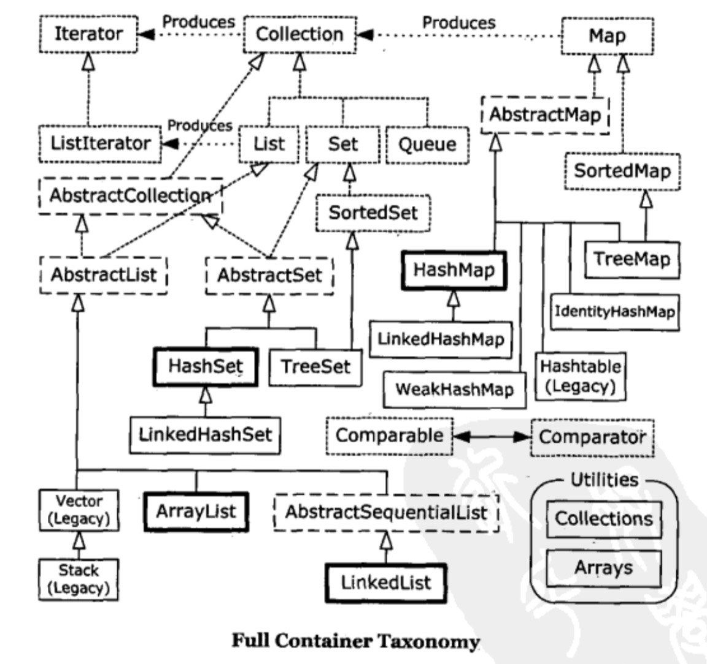

# JAVA编程思想学习七
> 第16章 ～ 第17章

## 第16章：数组

在Java中，数组是一种效率最高的存储和随机访问对象引用序列的方式。数组就是一个简单的线性序列，这使得元素访问非常快速。但是为这种快速所付出的代价就是数组对象的大小被固定，并且在其生命周期中不可改变。

### 数组是一级对象

无论使用哪种类型的数组，数组标识其实只是一个引用，指向堆中创建的一个真实对象，这个（数组）对象用以保存指向其他对象的引用。可以作为数组初始化语法的一部分隐式地创建此对象，或者用new表达式显式地创建。只读成员`length`是数组对象的一部分（事实上这是唯一一个可以访问的字段或方法），表示此数组对象可以存储多少元素。“[]”语法是访问数组对象唯一的方式。

### 返回数组

Java中可以返回一个数组

### 数组与泛型

可以参数化数组本身的类型

```
class ClassParameter<T> {
  public T[] f(T[] arg) { return arg; }
}

class MethodParameter {
  public static <T> T[] f(T[] arg) { return arg; }
}

public class Demo {
  public static void main(String[] args) {
    Integer[] ints = { 1, 2, 3, 4, 5 };
    Double[] doubles = { 1.1, 2.2, 3.3, 4.4, 5.5 };
    Integer[] ints2 =
      new ClassParameter<Integer>().f(ints);
    Double[] doubles2 =
      new ClassParameter<Double>().f(doubles);
    ints2 = MethodParameter.f(ints);
    doubles2 = MethodParameter.f(doubles);
  }
}
```

## 第17章：容器深入研究

### 完整的容器分类法




 

