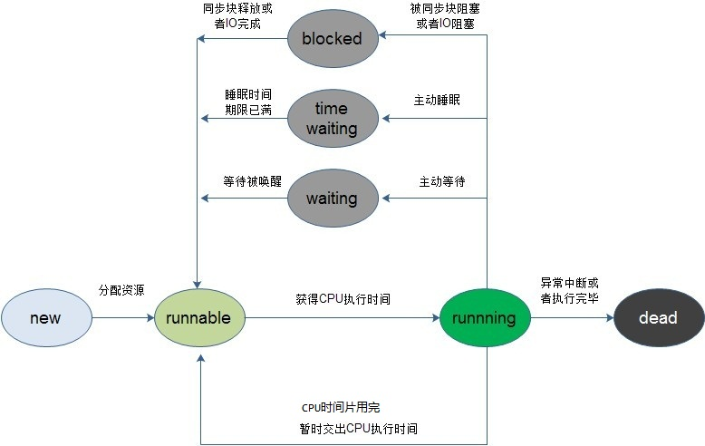
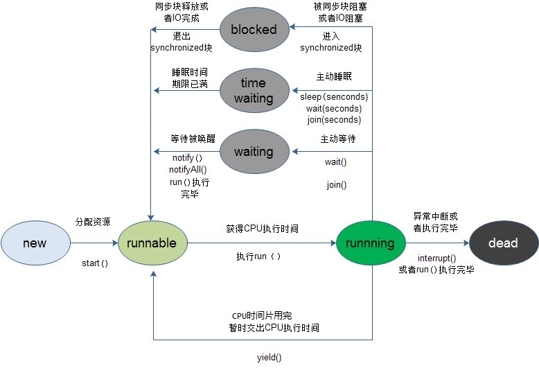

# Thread

## 线程的状态

线程从创建到最终的消亡，要经历若干个状态。一般来说，线程包括以下这几个状态：创建（new）、就绪（runnable）、运行（running）、阻塞（blocked）、time waiting、waiting、消亡（dead）。

线程创建之后，不会立即进入就绪状态，因为线程的运行需要一些条件（比如内存资源），只有线程运行需要的所有条件满足了，才进入就绪状态。

当线程进入就绪状态后，不代表立刻就能获取CPU时间，也许此时CPU正在执行其他的事情，因此它要等待。当得到CPU执行时间之后，线程便真正进入运行状态。

线程在运行状态过程中，可能有多个原因导致当前线程不继续运行下去，比如用户主动让线程睡眠，用户主动让线程等待，或者被同步块给阻塞。这些状态可以统称为阻塞状态。

当由于突然中断或者子任务执行完毕，线程就会被消亡。



## 上下文切换

对于单核CPU来说，CPU在一个时刻只能运行一个线程，当在运行一个线程的过程中去运行另一个线程，这个叫线程上下文切换。

由于可能当前线程的任务并没有执行完毕，所以在切换时需要保存线程的运行状态，以便下次重新切换回来时能够继续切换之前的状态运行。

因此需要记录线程A的运行状态，那么会记录哪些数据呢？因为下次恢复时需要知道在这之前当前线程已经执行到哪条指令了，所以需要记录程序计数器的值，另外比如说线程正在进行某个计算的时候被挂起了，那么下次继续执行的时候需要知道之前挂起时变量的值时多少，因此需要记录CPU寄存器的状态。所以一般来说，线程上下文切换过程中会记录程序计数器、CPU寄存器状态等数据。

说得简单点的：对于线程的上下文切换实际上就是：存储和恢复CPU状态的过程，它使得线程执行能够从中断点恢复执行。

## Thread中的方法

### join方法

join方法的作用是，让“父线程”等待“子线程”结束之后才能继续运行。

```
import java.util.concurrent.*;
import java.util.*;

public class Demo {
	public static void main(String[] args) throws Exception {
		System.out.println("进入线程"+Thread.currentThread().getName());
		Demo demo = new Demo();
		MyThread thread = demo.new MyThread();
		thread.start();

		try {
            System.out.println("线程"+Thread.currentThread().getName()+"等待");
            thread.join();
            System.out.println("线程"+Thread.currentThread().getName()+"继续执行");
        } catch (InterruptedException e) {
            
        }
	}

	class MyThread extends Thread {
		public void run() {
			System.out.println("进入线程"+Thread.currentThread().getName());
			try {
                Thread.currentThread().sleep(5000);
            } catch (InterruptedException e) {
                
            }
            System.out.println("线程"+Thread.currentThread().getName()+"执行完毕");
		}
	}
}


/*
进入线程main
线程main等待
进入线程Thread-0
线程Thread-0执行完毕
线程main继续执行
*/
```

### interrupt方法

`interrupt`方法，可以用来中断一个正处于阻塞状态的线程，另外通过`interrupt`方法和`isInterrupted`方法来停止正在运行的线程。

```
import java.util.concurrent.*;
import java.util.*;

public class Demo {
	public static void main(String[] args) throws Exception {
		Demo demo = new Demo();
		MyThread thread = demo.new MyThread();
		thread.start();

		try {
            Thread.currentThread().sleep(1);
        } catch (InterruptedException e) {
            
        }
        thread.interrupt();
	}

	class MyThread extends Thread {
		public void run() {
			int i = 0;
			while(!isInterrupted() && i < Integer.MAX_VALUE) {
				System.out.println("in while i = " + i);
				i++;
			}
			System.out.println("thread is interrupted");
		}
	}
}
```

但是一般情况下不建议通过这种方式来中断线程，一般会在MyThread类中增加一个属性 isStop来标志是否结束while循环，然后再在while循环中判断isStop的值。

```
import java.util.concurrent.*;
import java.util.*;

public class Demo {
	public static void main(String[] args) throws Exception {
		Demo demo = new Demo();
		MyThread thread = demo.new MyThread();
		thread.start();

		try {
            Thread.currentThread().sleep(1);
        } catch (InterruptedException e) {
            
        }
        thread.stop(true);
	}

	class MyThread extends Thread {
		private volatile boolean isStop = false;

		public void stop(boolean stop) {
			isStop = stop;
		}

		public void run() {
			int i = 0;
			while(!isStop) {
				System.out.println("in while i = " + i);
				i++;
			}
			System.out.println("thread is stopped");
		}
	}
}
```




## 参考资料

* [Java并发编程：Thread类的使用](https://www.cnblogs.com/dolphin0520/p/3920357.html)