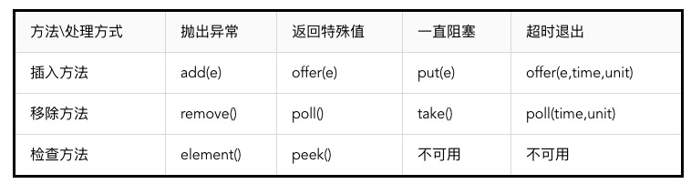

# 阻塞队列

使用非阻塞队列的时候有一个很大问题就是：它不会对当前线程产生阻塞，那么在面对类似消费者-生产者的模型时，就必须额外地实现同步策略以及线程间唤醒策略，这个实现起来就非常麻烦。但是有了阻塞队列就不一样了，它会对当前线程产生阻塞，比如一个线程从一个空的阻塞队列中取元素，此时线程会被阻塞直到阻塞队列中有了元素。当队列中有元素后，被阻塞的线程会自动被唤醒。这样提供了极大的方便些。

## 几种主要的阻塞队列

* ArrayBlockingQueue：基于数组实现的一个阻塞队列，在创建ArrayBlockingQueue对象时必须制定容量大小。并且可以指定公平性与非公平性，默认情况下为非公平性。所谓公平访问队列是指阻塞的所有生产者线程或消费者线程，当队列可用时，可以按照阻塞的先后顺序访问队列，即先阻塞的生产者线程，可以先往队列里插入元素，先阻塞的消费者线程，可以从队列里获取元素。通常情况下为了保证公平性会降低吞吐量。
* LinkedBlockingQueue：基于链表实现的一个阻塞队列，在创建LinkedBlockingQueue对象时如果不指定容量大小，则默认大小为Integer.MAX_VALUE。
* PriorityBlockingQueue：以上2种队列都是先进先出队列，而PriorityBlockingQueue却不是，它会按照元素的优先级对元素进行排序，按照优先级顺序出队，每次出队的元素都是优先级最高的元素。注意，此队列为无界队列。
* DelayQueue：基于PriorityQueue，一种延时阻塞队列，DelayQueue中的元素只有当其指定的延迟时间到了，才能够从队列中获取到元素。DelayQueue也是一个无界队列，因此往队列中插入数据的操作（生产者）永远不会被阻塞，而只有获取数据的操作（消费者）才会被阻塞。

## 方法



## 阻塞队列的原理

```
private final Condition notEmpty;

private final Condition notFull;
```

利用这两个Condition来控制

## 示例

```
import java.util.concurrent.*;
import java.util.concurrent.locks.*;
import java.util.*;

public class Demo {
	private int queueSize = 10;
	private ArrayBlockingQueue<Integer> queue = new ArrayBlockingQueue<Integer>(queueSize);

	public static void main(String[] args) throws Exception {
		Demo demo = new Demo();
		Producer producer = demo.new Producer();
		Consumer consumer = demo.new Consumer();

		producer.start();
		consumer.start();
	}

	class Consumer extends Thread {
		public void run() {
			consume();
		}

		private void consume() {
			while (true) {
				try {
					queue.take();
					System.out.println("take a object, size = " + queue.size());
				} catch (InterruptedException e) {
					e.printStackTrace();
				}
			}
		}
	}

	class Producer extends Thread {
		public void run() {
			produce();
		}

		private void produce() {
			while (true) {
				try {
					queue.put(1);
					System.out.println("put a object, size = " + queue.size());
				} catch (InterruptedException e) {
					e.printStackTrace();
				}
			}
		}
	}
}
```

## 参考资料

* [Java并发编程：阻塞队列](https://www.cnblogs.com/dolphin0520/p/3932906.html)