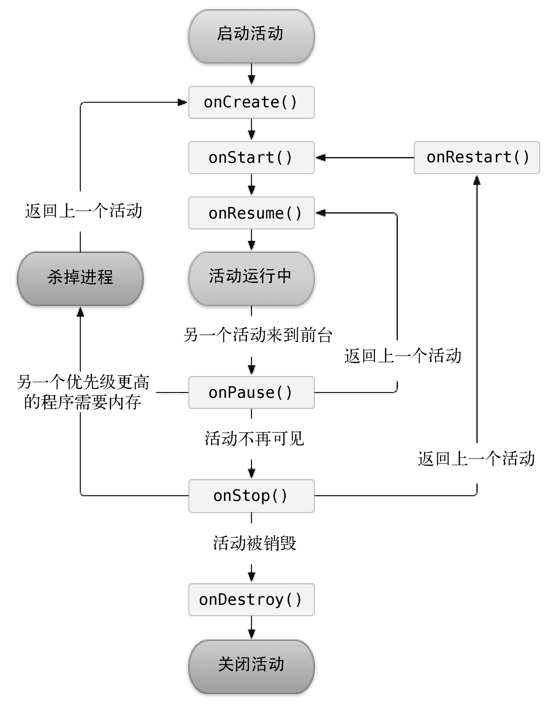

# 第一行代码学习1

> 第1章 ～ 第X章

## 第2章

### 使用Intent在活动之间穿梭

Intent是Android程序中各组件之间进行交互的一种重要方式，它不仅可以指明当前组件想要执行的动作，还可以在不同组件之间传递数据。Intent一般可被用于启动活动、启动服务以及发送广播等场景。

Intent大致可以分为两种：显示Intent和隐式Intent。

#### 向下一个活动传递数据

```
@Override
public void onClick(View v) {
    Intent intent = new Intent(FirstActivity.this, SecondActivity.class);
    intent.putExtra("extra_data", "Hello SecondActivity");
    startActivityForResult(intent, 1);
}
```

```
Intent intent = getIntent();
String data = intent.getStringExtra("extra_data");
Log.d("SecondActivity", data);
```

```
@Override
protected void onActivityResult(int requestCode, int resultCode, @Nullable Intent data) {
    switch (requestCode) {
        case 1:
            if (resultCode == RESULT_OK) {
                String returnedData = data.getStringExtra("data_return");
                Log.d("FirstActivity", returnedData);
            }
            break;
        default:
    }
}
```

### Activity活动状态

1. 运行状态：处于栈顶，且可见
2. 暂停状态：不处于栈顶位置，但仍然可见。例如：对话框弹出时
3. 停止状态：不再处于栈顶位置，且完全不可见的时候，就进入停止状态。有可能会被系统回收
4. 销毁状态：被移除

### Activity生存期

1. OnCreate：第一次创建的时候
2. OnStart：不可见变为可见的时候调用
3. OnResume：在Activity准备好和用户交互的时候调用，此时的Activity一定位于返回栈的栈顶，并且处于运行状态
4. OnPause：准备去启动或者恢复另一个Activity的时候调用。我们通常会在这个方法中将一些消耗CPU的资源释放掉，以及保存一些关键数据，但这个方法的执行速度一定要快。
5. OnStop：在Activity不可见的时候调用。和OnPuase方法的区别在于，如果启动新的Activity是一个对话框式的活动，那么onPause方法会得到执行，而onStop方法不会执行
6. OnDestroy：销毁之前调用
7. OnRestart：由停止状态变为运行状态，也就是Activity被重新启动

上面的方法除了OnRestart方法，其他都是两两相对的，从而又可以将Activity分为3种生存期

1. 完整生存期：OnCreate和OnDestroy之间
2. 可见生存期：OnStart和OnStop之间
3. 前台生存期：OnResume和OnPause之间



### 活动的启动模式

启动模式一共分为四种：

* standart：标准
* singleTop：返回栈的栈顶唯一
* singleTask：返回栈中唯一
* singleInstance：启用一个新的返回栈来管理Activity
