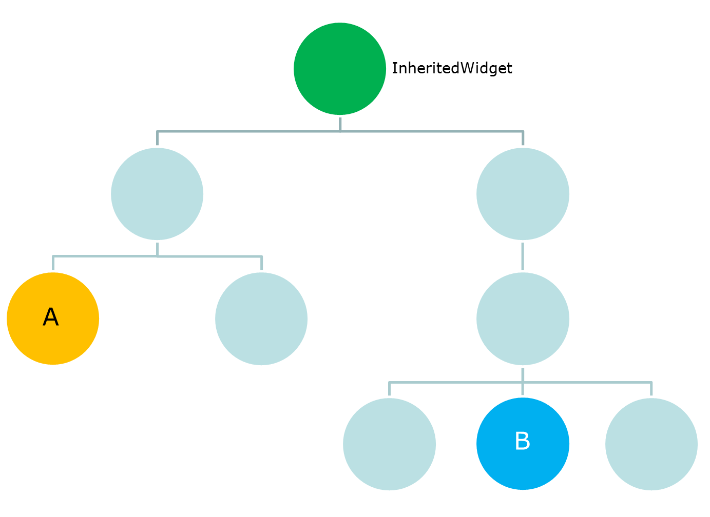

## InheritedWidget

简而言之，`InheritedWidget`可以在`Widget`树中有效地向下传递信息。`InheritedWidget`是一种特殊的`Widget`，可以将其插入`Widget`树中，作为一个`Widget`子树的父节点。该子树的所有`Widget`都能访问`InheritedWidget`的公共数据。

考虑如下代码：

```
class MyInheritedWidget extends InheritedWidget {
   MyInheritedWidget({
      Key key,
      @required Widget child,
      this.data,
   }): super(key: key, child: child);
	
   final data;
	
   static MyInheritedWidget of(BuildContext context) {
      return context.inheritFromWidgetOfExactType(MyInheritedWidget);
   }

   @override
   bool updateShouldNotify(MyInheritedWidget oldWidget) => data != oldWidget.data;
}
```

`context.inheritFromWidgetOfExactType()`允许所有子`Widget`获取最近包含`Context`的`InheritedWidget`实例，且`Widget`被自动添加到订阅列表中，当对`InheritedWidget`进行修改时，将自动重建。

`updateShouldNotify`方法，用于设置`InheritedWidget`是否必须通知所有子`Widget`（已注册/已订阅）。




假设如下情况：

1. `Widget A`是一个按钮，点击时将货物添加到购物车；
2. `Widget B`是一个文本，显示购物车中商品数量；
3. `Widget C`位于`Widget B`旁边，也是一个文本；
4. 我们希望在按下`Widget A`时自动在`Widget B`购物车中显示正确数量的项目，但我们不希望重建`Widget C`，`InheritedWidget`应用场景就在于此！


## 参考资料
1. [https://www.didierboelens.com/2018/06/widget---state---context---inheritedwidget/](https://www.didierboelens.com/2018/06/widget---state---context---inheritedwidget/)
2. [https://hongruqi.github.io/2019/01/26/Flutter%20%E6%B7%B1%E5%85%A5%E7%90%86%E8%A7%A3%20State/#more](https://hongruqi.github.io/2019/01/26/Flutter%20%E6%B7%B1%E5%85%A5%E7%90%86%E8%A7%A3%20State/#more)