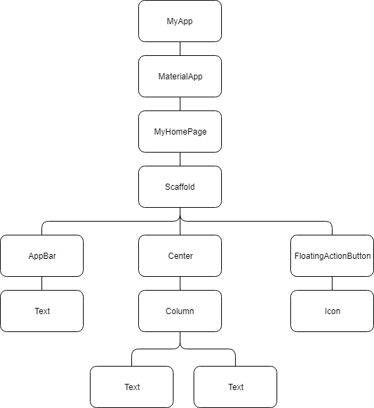
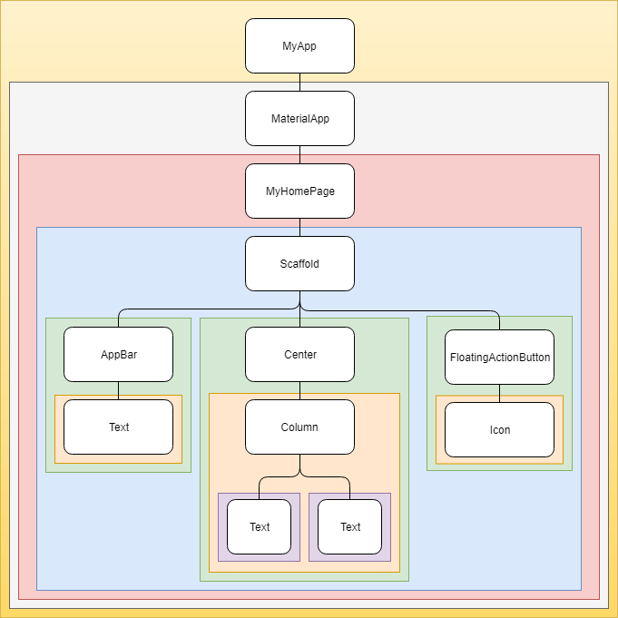

# 深入理解State

> by 木愚

本文主要介绍 Flutter 应用程序中 Widget，State，Context 和 InheritedWidget 等重要概念。 尤其注意的是 InheritedWidget，它是最重要且介绍较少的 Widget 之一。

## Widget树



## Context

> A context is nothing else but a reference to the location of a Widget within the tree structure of all the Widgets which are built.
> In short, think of a context as the part of Widgets tree where the Widget is attached to this tree.




## 两种Widgets

### StatelessWidget
`StatelessWidget`只依赖它们自己的配置信息，并不依赖于任何外部信息，配置信息在构建时由其父组件提供。换句话说，`StatelessWidget`一旦创建就不关心任何变化。

<font color=#FF0000>`StatelessWidget`只在加载或构建时绘制一次，这意味着无法基于任何事件或用户操作进行再次重绘。**这里要怎么理解绘制（drawn）？？？？**</font>

### StatelessWidget生命周期

* 初始化
* 通过`build`进行渲染

### StatefulWidget
XXX?

## State

> A State defines the "behavioural" part of a StatefulWidget instance

它包含两方面信息：
* 行为
* 布局

## State与Context之间的关系

对于`StatefullWidget`，`State`与`Context`是相关联的，且此关联是永久性的，`State`对象永远不会更改其`Context`。即使`Context`能够在Widget树内移动，`State`仍与`Context`相关联。

> As a State object is associated with a context, this means that the State object is NOT (directly) accessible through another context!


## StatefulWidget生命周期

### initState()

一旦初始化完成了，`State`对象就完成了初始化，同时`Context`和`State`对象绑定在一起且也能使用了。

### didChangeDependencies()

如果链接到`InheritedWidget`或者需要初始化一些`listener`（基于context），则要重写这个函数。

### build()

这个函数调用在`didChangeDependencies`和`didUpdateWidget`之后，这个函数用于构建`widget`。

每次`State`对象有更改时（或者当`InheritedWidget`需要通知“已注册”的`widget`时）都会调用此方法。

如果要主动重建，则可以调用`setState ( () {...})`方法。

### dispose()

当`widget`被弃用时，`dispose()`方法会被调用。当需要做一些清理工作时（如`listener`），重写此方法，然后再调用`super.dispose()`。

<font color=#FF0000>didUpdateWidget、deactivate、reassemble 这里还漏了几个函数</font>

## StatefulWidget由两部分组成

### Widget

这部分在其生命周期里都不会有改变。

### State

这部分在其生命周期里会有所变化的。_MyState类可以通过这样的方式widget.{变量名}访问存储在_MyWidget中的任何变量。示例：widget.color。

## Widget的唯一标识 - Key

在Flutter中，每个Widget都是唯一标识的。这个唯一ID就是可选参数Key，如果省略，Flutter将为你生成一个。以下几个类中，可以生成你想要的Key：
1. GlobalKey
2. LocalKey
3. UniqueKey
4. ObjectKey


## 访问State
我们要如何访问`State`呢？通过前面所述，`State`关联一个`Context`，`Context`关联一个`Widget`实例。

### 1.Widget本身
理论上说，唯一能够访问`State`的就是`Widget`本身。

### 2.子Widget

有时候，父`widget`需要根据子`widget`的不同`State`来执行相应任务。如前所述，可以使用`Key`来标识`Widget`

```
...
GlobalKey<MyStatefulWidgetState> myWidgetStateKey = new GlobalKey<MyStatefulWidgetState>();
...
@override
Widget build(BuildContext context){
    return new MyStatefulWidget(
        key: myWidgetStateKey,
        color: Colors.blue,
    );
}
```
一旦确定，父`widget`就可以通过以下方式访问其子`widget`的`State`

```
myWidgetStateKey.currentState
```

示例代码：<font color=#FF0000>这里要怎么理解，没发现是父Widget访问其子Widget</font>

```
class _MyScreenState extends State<MyScreen> {
    /// the unique identity of the Scaffold
    final GlobalKey<ScaffoldState> _scaffoldKey = new GlobalKey<ScaffoldState>();

    @override
    Widget build(BuildContext context){
        return new Scaffold(
            key: _scaffoldKey,
            appBar: new AppBar(
                title: new Text('My Screen'),
            ),
            body: new Center(
                new RaiseButton(
                    child: new Text('Hit me'),
                    onPressed: (){
                        _scaffoldKey.currentState.showSnackBar(
                            new SnackBar(
                                content: new Text('This is the Snackbar...'),
                            )
                        );
                    }
                ),
            ),
        );
    }
}
```

### 3.Widget祖先

对外暴露的方法


## 参考资料
1. [https://www.didierboelens.com/2018/06/widget---state---context---inheritedwidget/](https://www.didierboelens.com/2018/06/widget---state---context---inheritedwidget/)
2. [https://hongruqi.github.io/2019/01/26/Flutter%20%E6%B7%B1%E5%85%A5%E7%90%86%E8%A7%A3%20State/#more](https://hongruqi.github.io/2019/01/26/Flutter%20%E6%B7%B1%E5%85%A5%E7%90%86%E8%A7%A3%20State/#more)
3. [https://www.jianshu.com/p/ee2802d67085](https://www.jianshu.com/p/ee2802d67085)