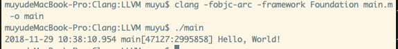

# Clang命令简单学习

Clang是一个C、C++、Objective-C和Objective-C++编程语言的编译前端，其后端为底层虚拟机（LLVM）。是一个GCC的替代品，也是XCode的首选编译器。

通过Clang，我们可以做什么？

* 编译OC代码，这也是它的本职工作
* 可以将OC代码转化为C++或汇编代码，从而窥探OC某些特写的底层实现
* 在终端快速编译，占用较少内存，同时具有诊断功能

## 编译OC代码

除了使用XCode编译工程，我们也可以通过Clang来手动编译。

ARC下编译指令

```
clang -fobjc-arc -framework Foundation main.m -o main
```

MRC下编译指令

```
clang -fno-objc-arc -framework Foundation main.m -o main
```

* -framework 所使用的框架名
* -o 输出的可执行文件名

在main.m文件中写下如下代码

```
#import <Foundation/Foundation.h>

int main(int argc, const char * argv[])
{
    NSLog(@"Hello, World!");
    return 0;
}
```

编译代码后，在终端执行结果如下：



## 转换为C++代码

OC底层实现为C/C++，所以要研究其底层机制，就要用到Clang的代码转化

将OC的.m文件转化为C++源码

```
clang -rewrite-objc main.m
```

## 转换为汇编代码

```
clang -S main.m
```


## 参考资料

* [Objective-C开发中Clang的使用](http://minecode.link/2017/12/21/Objective-C%E5%BC%80%E5%8F%91%E4%B8%ADClang%E7%9A%84%E4%BD%BF%E7%94%A8/)


