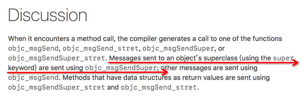

# Runtime学习2

> super和self比较

先来看看下面的代码输出什么？


```

@implementation Son : Father

- (id)init
{
    self = [super init];
    if (self) {
        NSLog(@"%@", NSStringFromClass([self class]));
        NSLog(@"%@", NSStringFromClass([super class]));
    }
    return self;
}

@end

```

答案：都输出Son。

其实super是一个Magic Keyword，它本质是一个编译器标示符，和self都指向同一个消息接受者！不同点在于：Super会告诉编译器，调用class这个方法时，要去父类的方法，而不是本类里。

上面的例子中，因为class方法属于NSObject，对象Son *xxx，结果自然是Son。


## Runtime源码

搜索`objc_msgSendSuper`，会看到如下这么一句话



这里明确提到了使用super关键字发送消息会被编译器转化为`objc_msgSendSuper`及相关函数（由返回值决定）。

此函数声明如下

```
id objc_msgSendSuper(struct objc_super *super, SEL op, ...);


struct objc_super {
    /// Specifies an instance of a class.
    __unsafe_unretained _Nonnull id receiver;

    /// Specifies the particular superclass of the instance to message. 
#if !defined(__cplusplus)  &&  !__OBJC2__
    /* For compatibility with old objc-runtime.h header */
    __unsafe_unretained _Nonnull Class class;
#else
    __unsafe_unretained _Nonnull Class super_class;
#endif
    /* super_class is the first class to search */
};
```

结构体中receiver就是self中的id，而super_class，看注释可以知道是一开始寻找方法实现的父类（第一父类）。


## 参考资料

* [iOS super 关键字帮我们做了什么？](https://juejin.im/post/59395e77ac502e006cc580a3)


