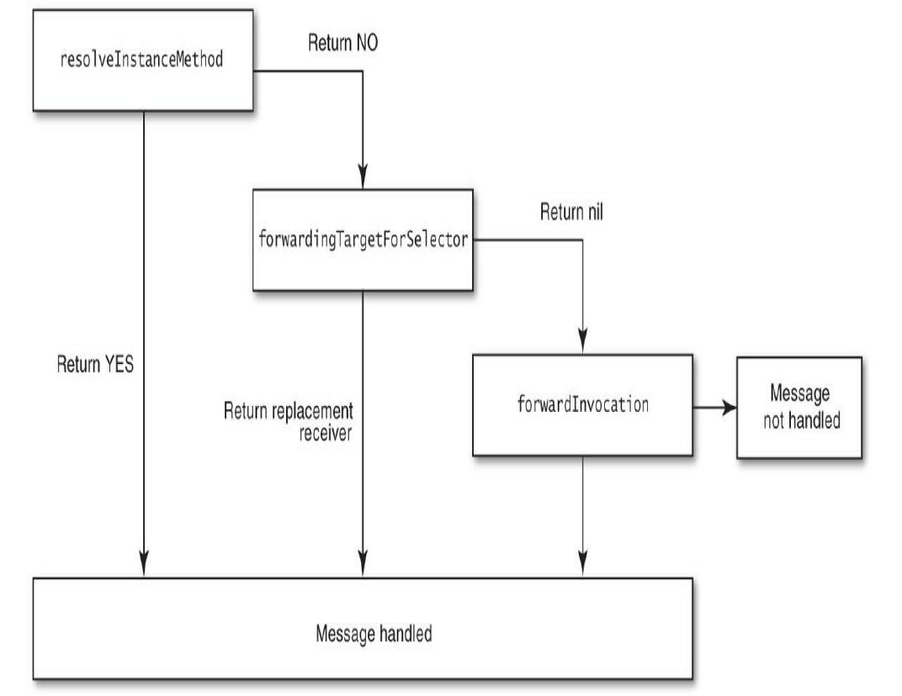

# Runtime学习3
> 消息发送与转发机制原理

Objective-C中`[receiver message]`会被编译器转化为：

```
objc_msgSend(receiver, selector)
```

如果消息含有参数，则为：

```
objc_msgSend(receiver, selector, arg1, arg2, ...)
```

Objective-C中的消息发送和转发流程可以概括为：消息发送（Messaging）是Runtime通过selector快速查找IMP的过程，有了函数指针就可以执行对应的方法实现；消息转发（Message Forwarding）是在查找IMP失败后执行一系列转发流程的慢速通道，如果不作转发处理，则会打日志和抛出异常。


## 消息发送步骤

1. 检测这个selector是不是要忽略。比如Mac OS X开发，有了垃圾回收就不理会的retain，release这些函数。（注：这个步骤目前应该不需要了）
2. 检测target是不是nil对象，是则忽略掉。
3. 在cache中找IMP
4. 找方法列表
5. 找父类的方法列表
6. 如果还找不到就要开始进入动态方法解析了

## 动态方法解析
上述1-5点都比较好理解的，接下来着重讲下动态方法解析。在Runtime在上述五点中找不到执行的方法时，Runtime会调用`resolveInstanceMethod`或`resolveClassMethod`来给程序员一次动态添加方法实现的机会。需要做的是用`class_addMethod`函数完成向特定类添加特定方法实现的操作。

## 重定向

在消息转发机制前，Runtime会再给我们一次偷梁换柱的机会，即通过重载`-/+ (id)forwardingTargetForSelector:(SEL)aSelector`方法替换消息的接受者为其他对象。

```
- (id)forwardingTargetForSelector:(SEL)aSelector
{
    if(aSelector == @selector(mysteriousMethod:)){
        return alternateObject;
    }
    return [super forwardingTargetForSelector:aSelector];
}
```

## 消息转发
如果上述都不执行，则`forwardInvocation`会被执行，这里我们可以对不能处理的消息做一些默认的处理（可参考demo），也可以将消息转发给其他对象来处理。下面展示后者的方式:

```
- (void)forwardInvocation:(NSInvocation *)anInvocation
{
    if ([someOtherObject respondsToSelector:
            [anInvocation selector]])
        [anInvocation invokeWithTarget:someOtherObject];
    else
        [super forwardInvocation:anInvocation];
}
```

## 抛出异常

如果还不能命中，则抛出异常

```
- (void)doesNotRecognizeSelector:(SEL)aSelector
```

## 流程图



## 参考资料
* [继承自NSObject的不常用又很有用的函数](https://www.cnblogs.com/biosli/p/NSObject_inherit_2.html)


