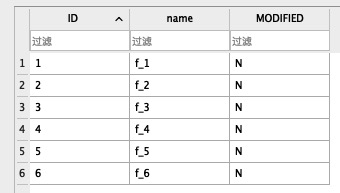

# SQLites事务

事务定义了一组SQL命令的边界，这组命令或者作为一个整体被全部执行，或者都不执行，这被称为数据库完整性的原子性原则。

## 事务的范围

事务由3个命令控制：`begin`、`commit`和`rollback`。`begin`开始一个事务，`begin`之后的所有操作都可以取消，如果连接中止前没有发出`commit`，也会取消。`commit`提交事务开始后所执行的所有操作。类似地，`rollback`还原`begin`之后的所有操作。

```
BEGIN;
DELETE FROM FOODS;
ROLLBACK;
SELECT COUNT(*) FROM FOODS;
```

因此采取了`rollback`操作，故而`Foods`表没有被删除。

默认情况下，SQLite中每条SQL语句自成事务（自动提交模式）。

## 冲突的解决

SQLite有其独特的方法允许你指定不同的方式来处理约束违反（或者说从约束违反中恢复），这种功能称为冲突解决。

例如，有表如下：



则，执行命令

```
UNIQUE constraint failed: FOODS.ID
```

会报错

```
Result: UNIQUE constraint failed: FOODS.ID
At line 1:
UPDATE FOODS SET ID = 10 - ID;
```

这是因为在执行到第4条记录时，它试图将ID更新为`10-4=6`，和第6条记录冲突，违反了唯一性约束。如果想让已经修改的5个记录继续保留，该怎么办？

SQLite提供5种可能的冲突解决方案或策略，它们可以用来解决冲突（约束违反）: `replace`、`ignore`、`fail`、`abort`和`rollback`。这5种方法定义了错误容忍范围或敏感度：从最宽松的`replace`，到最严格的`rollback`。

* replace：当违反了唯一性约束，将删除在插入或更新当前行之前导致违反约束的预先存在的行，并且该命令将继续正常执行，且不报错。如果违反了NOT NULL约束，使用该字段的默认值代替NULL。如果该字段没有默认值，SQLite应用abort策略。**<font color=#FF0000>abort策略要怎么测试？？</font>**
* ingore：当约束违反发生时，SQLite允许命令继续执行，违反约束的行保持不变。而它之前和之后的记录都继续修改。也就是说。所有会触发约束违反的行都不动，保持原貌，命令继续处理其他的，且不报错。
* fail：当约束违反发生时，SQLite终止命令，但是不恢复违反之前已经修改的记录。也就是说，在约束违反发生前的改变都保留。
* abort：当约束违反发生时，SQLite恢复命令所做的所有改变并终止命令。abort是SQLite中所有操作的默认解决方法，也是SQL标准定义的行为。注意：abort也是最昂贵的冲突解决策略——要求额外的工作，设置要求没有冲突发生。
* rollback：当约束违反发生时，SQLite执行回滚——终止当前命令和整个事务。最终结果就是当前命令所做的改变和事务之前的改变都被回滚。这也是最严格的冲突解决方法，单个约束违反导致事务中执行的所有操作都回滚。

冲突解决方法既可以在SQL命令中指令，也可以在表和索引的定义执行。具体地讲，冲突解决方法可以在`insert`、`update`、`create table`和`create index`中指定。

```
insert or resolution into table (column_list) values (value_list);
update or resolution table set (value_list) where predicate;
```

例子：

```
UPDATE OR REPLACE FOODS SET ID = 10 - ID;
```

结果如下：


## 数据库锁

在SQLite中，锁和事务是紧密联系的。SQLite采用粗粒度的锁。当一个连接要写数据库时，所有其他的连接被锁住，直到连接结束它的事务。SQLite有一个加锁表，用来帮助不同的写数据库都能够在最后一刻再加锁，以保证最大的并发性。

SQLite使用锁逐步提升机制，为了写数据库，连接需要逐级获得排它锁。SQLite有5种不同的锁状态：未加锁（unlocked）、共享（shared）、预留（reserved）、待定（pending）和排它（exclusive）。每个数据库连接在同一时刻只能处于其中一个状态，每种状态（unlocked除外）都有一种锁与之对应。

最初的状态是未加锁状态，在此状态下，连接还没有访问数据库。当连接一个数据库，甚至已经用`BEGIN`开始了一个事务时，连接都还处于未加锁状态。

未加锁状态的下一个状态是共享状态。为了能够从数据库中读（不是写）数据，连接必须首先进入共享状态，也就是说，首先要获得一个共享锁。多个连接可以同时获得并保持共享锁，也就是说，多个连接可以同时从同一个数据库中读数据。但哪怕只有一个共享锁还没有释放，也不会允许任何连接写数据库。

如果一个连接想要写数据库，它必须首先获得一个预留锁。一个数据库同时只能有一个预留锁，该预留锁可以与共享锁共存，它是写数据库的第1阶段。预留锁既不阻止其他拥有共享锁的连接继续读数据库，也不阻止其他连接获得新的共享锁。

一旦一个连接获得了预留锁，它就可以开始处理数据库修改操作了，尽管这些修改只能在缓冲区中进行，而不是实际写到磁盘，对读出内容所做的修改保存在内存缓冲区中。

当连接想要修改提交修改（或事务）时，需要将预留锁提升为排它锁。为了得到排它锁，还必须首先将预留锁提升为待定锁。获得待定锁之后，其他连接就不能再获得新的共享锁了，但已经拥有共享锁的连接仍然可以继续正常读数据库。此时，拥有待定锁的连接等待其他拥有共享锁的连接完成工作并释放其共享锁。

一旦所有的其他共享锁都被释放，拥有待定锁的连接就可以将其锁提升至排它锁，此时就可以自由地对数据库进行修改。所有以前所缓存的修改都会被写到数据库文件中。

## 死锁


## 事务的类型

SQLite有三种不同的事务类型，它们以不同的锁状态启动事务。事务可以开始于：`defferred`、`immediate`或`exclusive`。事务类型在`begin`命令中指定：

`begin [deferred | immediate | exclusive] transaction`

一个`defferred`直到必须使用时才获取锁。因此，对于延迟事务，`begin`语句本身不会做什么事情——它从未锁定状态开始。这是默认的情况。如果仅仅用`begin`开始一个事务，那么事务就是延迟的，停留在未锁定状态。多个连接可以在同一时刻未创建任何锁的情况下开始延迟事务。这种情况下，第一个对数据库的读操作获取共享锁，类似地，第一个对数据库的写操作试图获取预留锁。

由`begin`开始的`immediate`事务在`begin`执行时试图获取预留锁。如果成功，`begin immediate`保证没有其他的连接可以写数据库。正如您知道的，其他的连接可以继续对数据库进行读操作，但是，预留锁会阻止其他新的连接读取数据库。预留锁的另一个结果是没有其他连接能成功启动`begin immediate`或者`begin exclusive`命令，当其他连接执行上述命令时，SQLite会返回`SQLITE_BUSY`错误。这时您可以对数据库进行修改操作，但是您还不能提交，当调用`commit`时，会返回`SQLITE_BUSY`错误。这意味着还有其他的读事务没有完成，需要等待它们执行完成后才能提交事务。

`exclusive`事务会试着获取对数据库的排它锁。这与`immediate`工作方式类似，但是一旦成功，`exclusive`事务保证数据库中没有其他的活动连接，所以就可对数据库进行任意的读写操作。

前面例子的问题在于两个连接最终都想写数据库，但是它们都没有放弃各自原来的锁，最终，共享锁导致了问题。如果两个连接都以`begin immediate`开始事务，那么死锁就不会发生。在这种情况下，在同一时刻只能有一个连接进入`begin immediate`，其他的连接就得等待。必须等待的连接将会不断尝试以确保它最终能开始`immediate`事务。如果所有想对数据库进行写操作的连接使用`begin immediate`和`begin exclusive`，那它就提供了一种同步机制，通过这种机制防止了死锁的产生。要使这种方式可以工作，所有的人都必须遵守规则。

基本的准则是：如果使用的数据库没有其他连接，用`begin`就足够了。但是，如果使用的数据库有其他也会对数据库进行写操作的连接，就得使用`begin immediate`或者`begin exclusive`开始事务。

## 锁状态


白色的锁状态——未锁定（unlocked）、待定（pending）、共享（shared）和预留（reserved）——全都可以在同一时间同一数据库的不同连接中存在。不过，从灰色的待定锁开始，限制就更多了。灰色的待定状态代表锁正在被某个连接拥有，即某个想要获取独占锁的写操作。与此相反，白色的待定状态表示连接获取和释放共享锁的途径。尽管有这些不同的锁状态，但是所有的SQLite事务都可以归结为两种类型之一：读事务和写事务。

## 读事务

```
db = open('foods.db')
db.exec('begin')
db.exec('select * from foods')
db.exec('select * from foods')
db.exec('commit')
db.close()
```

代码的锁路径如下：

```
UNLOCKED->PENDING->SHARED->UNLOCKED
```

## 写事务

锁路径如下：

```
UNLOCKED->PENDING->SHARED->UNLOCKED->RESERVED->PENDING->EXCLUSIVE->UNLOCKED
```


## 需要用到的数据库命令

```
ALTER TABLE FOODS ADD COLUMN TYPE TEXT NOT NULL;

INSERT INTO FOODS VALUES(1, 'f_1', 'N');
INSERT INTO FOODS VALUES(2, 'f_2', 'N');
INSERT INTO FOODS VALUES(3, 'f_3', 'N');
INSERT INTO FOODS VALUES(4, 'f_4', 'N');
INSERT INTO FOODS VALUES(5, 'f_5', 'N');
INSERT INTO FOODS VALUES(6, 'f_6', 'N');

DELETE FROM FOODS;
```

## 参考链接

[腾讯云 - ON CONFLICT clause](https://cloud.tencent.com/developer/section/1419896)
[SQLite 事务](https://www.sunzn.com/2017/11/24/SQLite-%E4%BA%8B%E5%8A%A1/)


